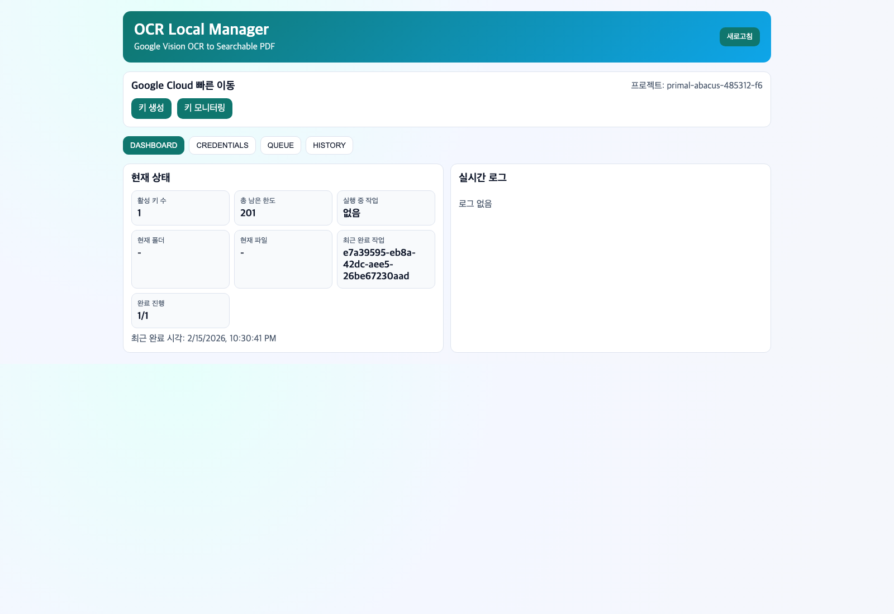
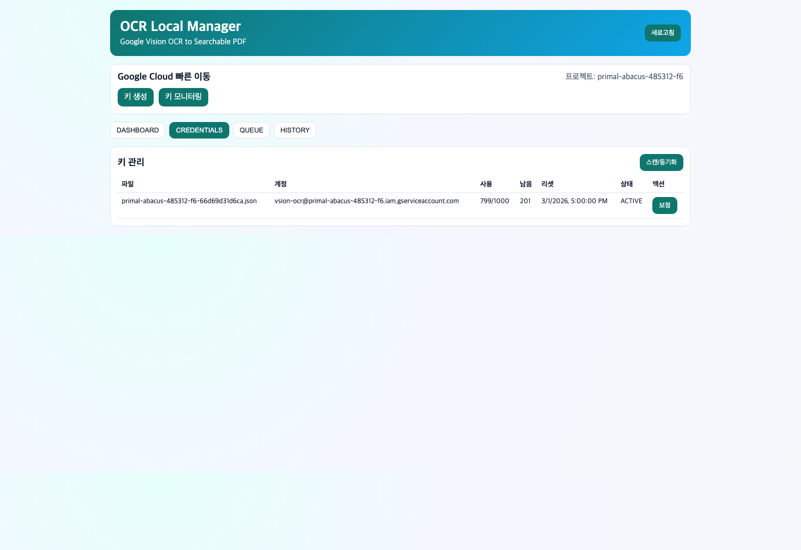
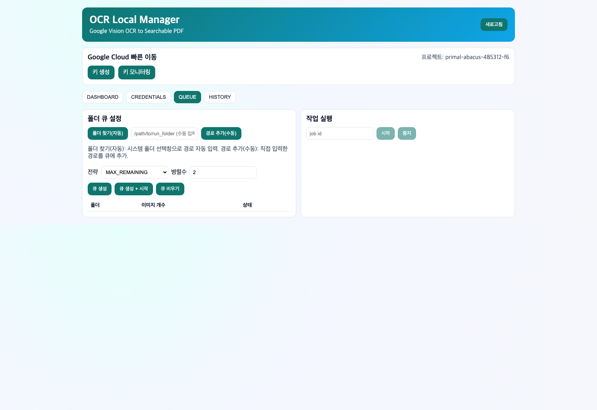
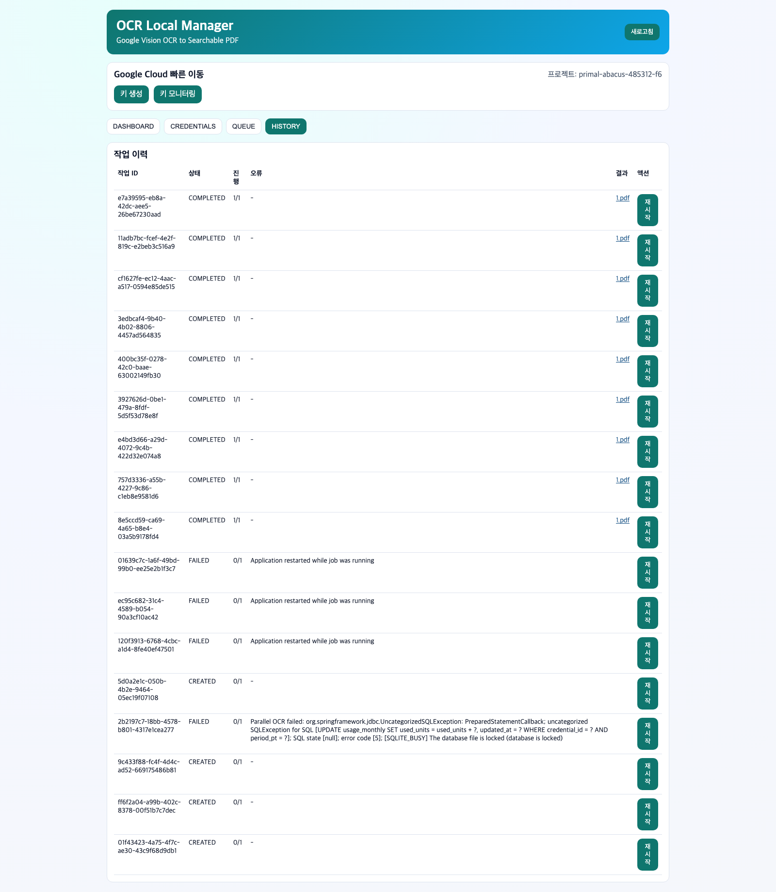

# OCR Local Web App (Java + React)

로컬에서 Google Vision OCR을 사용해 이미지 폴더를 검색 가능한 PDF로 변환하는 앱입니다.

## 주요 기능
- 서비스 계정 JSON 다중 관리
- JSON별 월 1000 한도 추적 (PT 기준 월초 자동 리셋)
- 폴더 재귀 이미지 개수 표시 (`png/jpg/jpeg/webp`)
- 다중 폴더 큐 처리
- 키 소진 시 자동 전환
- OCR 실패 시 전체 작업 즉시 중단
- 중단/실패 후 같은 Job 재시작 시 SQLite 체크포인트 기준 이어서 처리
- 원본 이미지 + invisible text layer 검색 가능 PDF 생성
- Google Cloud 빠른 이동 링크 제공

## OCR/PDF 로직 (최신)
- OCR 호출:
  - 이미지 1장당 Google Vision `DOCUMENT_TEXT_DETECTION` 1회 호출
  - 언어 힌트 `ko,en` 사용
- PDF 생성:
  - 원본 이미지를 페이지 배경으로 그대로 삽입
  - OCR 텍스트는 invisible text layer로 별도 추가
  - 기본 전략은 **라인 좌표 고정 방식**(원문 글자 위치에 맞춰 드래그/검색 정합성 우선)
  - 한국어 조사 결합 규칙 일부 적용 (`주식 의` -> `주식의` 계열 완화)
  - 좌표 정보가 부족한 경우에만 텍스트 블록 fallback 사용
- 주의:
  - 로직 변경 전 생성된 PDF는 자동 갱신되지 않음
  - 새 로직 반영 결과가 필요하면 해당 폴더를 다시 실행해 PDF 재생성 필요

## 서비스 화면 (사용자 관점)
### 1) Dashboard
- 현재 실행 상태, 남은 한도, 진행 상황, 실시간 로그 확인


### 2) Credentials
- JSON 키 목록, 사용량/남은 한도, 리셋 시각, 수동 보정


### 3) Queue
- OCR 대상 폴더 추가, 이미지 개수 확인, 전략/병렬수 설정, 작업 시작/중지


### 4) History
- 작업 이력, 실패 원인, 생성된 PDF 링크 확인


## 폴더 구조
- `/Users/kmg/Project/ocr/backend` Spring Boot
- `/Users/kmg/Project/ocr/frontend` React(Vite)
- `/Users/kmg/Project/ocr/credentials` JSON 키
- `/Users/kmg/Project/ocr/output/pdf` PDF
- `/Users/kmg/Project/ocr/output/reports` 실행 리포트
- `/Users/kmg/Project/ocr/state/app.db` SQLite

## 개발 실행
### 1) 프론트
```bash
cd /Users/kmg/Project/ocr/frontend
npm install
npm run dev
```

### 2) 백엔드
```bash
cd /Users/kmg/Project/ocr/backend
mvn spring-boot:run
```

- 프론트: `http://localhost:5173`
- 백엔드: `http://localhost:8787`

## 배포 빌드 (단일 jar)
```bash
cd /Users/kmg/Project/ocr/backend
mvn -Pbundle-frontend -DskipTests package
```

생성물:
- `/Users/kmg/Project/ocr/backend/target/ocr-app.jar`

실행:
```bash
cd /Users/kmg/Project/ocr/backend
java -jar target/ocr-app.jar
```

브라우저 자동 오픈 끄기:
```bash
java -jar target/ocr-app.jar --ocr.browser.auto-open=false
```

## CLI 옵션
- `--credentials-dir=/some/path` (복수 가능)
- `--ocr.browser.auto-open=false`
- `--server.port=8787`

## API 요약
- `GET /api/credentials`
- `POST /api/credentials/scan`
- `PATCH /api/credentials/{id}/usage`
- `POST /api/system/pick-folder`
- `GET /api/folders/stats?path=...`
- `POST /api/jobs`
- `GET /api/jobs`
- `GET /api/jobs/{id}`
- `POST /api/jobs/{id}/start`
- `POST /api/jobs/{id}/stop`
- `GET /api/events`
- `GET /api/meta/external-links`

## 키 파일 정책
- 기본은 `/Users/kmg/Project/ocr/credentials` 스캔
- 앱 시작 시 `/Users/kmg/Project/ocr/*.json` 서비스계정 키는 자동으로 `credentials` 폴더로 이동

## 주의
- JSON 키는 외부 공유 금지
- 키 전환은 앱 내부 사용량 기준이며, 콘솔에서 별도 사용된 호출은 자동 반영되지 않을 수 있습니다.
- 이어하기 기능은 `state/app.db`의 `ocr_page_checkpoints`를 사용합니다.

## 트러블슈팅 기록
- 상세 장애/원인/조치 문서: `/Users/kmg/Project/ocr/TROUBLESHOOTING.md`
